 

# 👋 Hi, I'm Shreya

### 💻 Frontend Developer

Building modern digital experiences with React, JavaScript & AI.

 

 

  

# 📊 GITHUB ANALYTICS

### My coding activity, visualized.

 

  

# 🐍 CONTRIBUTION FLOW

### Every commit leaves a trace.

 

<picture>
  <source media="(prefers-color-scheme: dark)" srcset="./profile/github-contribution-grid-snake-dark.svg">
  <source media="(prefers-color-scheme: light)" srcset="./profile/github-contribution-grid-snake.svg">
  
</picture>

  

# ⚡ CURRENTLY BUILDING

### Turning ideas into real products.

 

<table>
<tr>

<td align="center" width="33%">

### 🤖 AI

Building intelligent interfaces  
and experimenting with  
computer vision.

</td>

<td align="center" width="33%">

### ⚛️ FRONTEND

Creating modern  
React experiences with  
clean UI/UX.

</td>

<td align="center" width="33%">

### 🚀 OPEN SOURCE

Learning, contributing  
and building projects  
in public.

</td>

</tr>
</table>

 

### 🟣 STATUS

`● ONLINE` &nbsp;&nbsp; `BUILDING` &nbsp;&nbsp; `LEARNING`

  

# 🧬 TECH ARSENAL

### Technologies I use to build things.

 

<table>
<tr>

<td align="center" width="25%">

### ⚛️ FRONTEND

HTML  
CSS  
JavaScript  
React  
Vite  
Tailwind CSS

</td>

<td align="center" width="25%">

### 🧠 AI / ML

Python  
OpenCV  
MediaPipe  
AI  
Computer Vision

</td>

<td align="center" width="25%">

### ⚙️ BACKEND

Node.js  
Express.js  
MySQL  
REST APIs  
Multer

</td>

<td align="center" width="25%">

### 🛠️ TOOLS

Git  
GitHub  
VS Code  
Figma  
Postman

</td>

</tr>
</table>

 

`REACT` &nbsp; `JAVASCRIPT` &nbsp; `PYTHON` &nbsp; `NODE.JS` &nbsp; `GIT` &nbsp; `AI`

  

# 🌐 LET'S CONNECT

### Have an idea? Let's build something amazing together.

 

&nbsp;

  

`BUILD • CREATE • LEARN • REPEAT`

 

### ✦ Thanks for visiting my corner of the internet ✦

